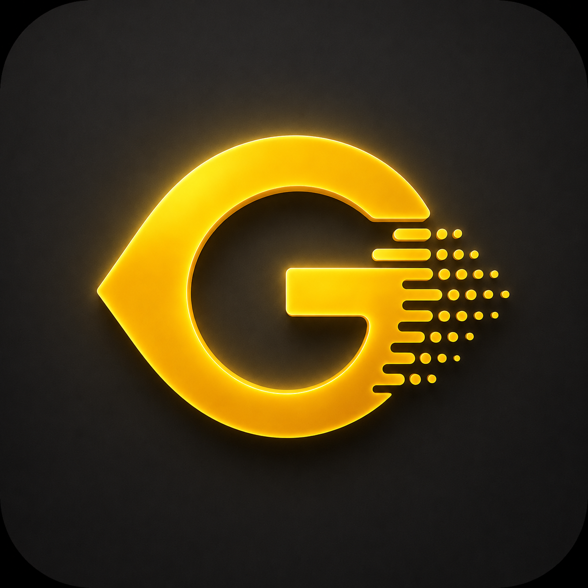

# 🛡️ Glance — Premium Anti-Shoulder-Surfing Privacy Overlay

<p align="center">
  
</p>

[](https://flutter.dev)
[](https://kotlinlang.org)
[](https://developer.android.com)
[](https://opensource.org/licenses/MIT)

**Glance** là ứng dụng bảo mật màn hình cao cấp được thiết kế theo phong cách tối giản, sang trọng (Luxury Brand Voice), giúp chống nhìn trộm (Anti-Shoulder-Surfing) hiệu quả khi bạn sử dụng thiết bị ở những nơi công cộng hoặc thực hiện các giao dịch tài chính nhạy cảm.

---

## 🌟 Giới Thiệu Chung

Trong kỷ nguyên số, thông tin hiển thị trên màn hình điện thoại luôn đối mặt với nguy cơ bị nhìn trộm ở quán cà phê, xe buýt, sân bay hoặc thậm chí là tại văn phòng. **Glance** giải quyết triệt để vấn đề này bằng cách tận dụng cảm biến con quay hồi chuyển (gyroscope) tích hợp để tự động phủ một lớp rèm bảo mật màu đen tuyệt đối lên màn hình ngay khi thiết bị bị nghiêng ra ngoài góc nhìn cá nhân an toàn của bạn.

Với ngôn ngữ thiết kế **"Platinum & Gold"** đẳng cấp, Glance mang lại trải nghiệm tinh tế, chuyên nghiệp tương tự như giao diện của các ứng dụng ngân hàng tư nhân (Private Banking) cao cấp nhất.

---

## ✨ Các Tính Năng Nổi Bật

### 1. Lá Chắn Góc Nghiêng Thông Minh (Sensor-Driven Overlay)
* Tự động đo lường độ lệch góc nhìn theo hai trục **Pitch (Trước/Sau)** và **Roll (Trái/Phải)** qua luồng dữ liệu thời gian thực (tần số 10Hz tiết kiệm pin).
* Kích hoạt lớp phủ che mờ màn hình ngay khi thiết bị lệch khỏi vùng an toàn.

### 2. Thuật Toán Trễ Chống Nhấp Nháy (Hysteresis Flicker Guard)
* Tích hợp cơ chế bù trừ sai số (Hysteresis Dead Zone) tự động điều chỉnh từ $2^\circ$ đến $20^\circ$.
* Ngăn chặn hiện tượng màn hình nhấp nháy liên tục khi người dùng cầm máy ở ranh giới của góc nghiêng bảo vệ.

### 3. Hai Chế Độ Phủ Linh Hoạt (Coverage Modes)
* **Toàn Màn Hình (Full Screen):** Bảo vệ toàn bộ khu vực hiển thị của thiết bị.
* **Vùng Tùy Chỉnh (Targeted Area):** Cho phép vẽ một vùng chữ nhật bảo vệ tùy ý trên màn hình qua bộ biên tập trực quan. Chỉ làm mờ vùng nhạy cảm đã chọn (ví dụ: khung chat, thông tin số dư ví, mật khẩu) khi bị nghiêng máy.

### 4. Hai Cấp Độ Bảo Mật Tùy Chọn (Protection Levels)
* **Chế Độ Tiêu Chuẩn (Standard Mode):** Sử dụng quyền vẽ đè hệ thống (`SYSTEM_ALERT_WINDOW`), tương thích hoàn hảo và chạy mượt mà trên tất cả ứng dụng, bao gồm cả các ứng dụng tài chính/ngân hàng khó tính.
* **Chế Độ Tối Đa (Maximum Mode):** Sử dụng quyền Trợ năng (`AccessibilityService`) kết hợp cử chỉ thông minh. Đảm bảo bảo mật cấp độ cao nhất trước các hành vi chụp ảnh màn hình hoặc ghi đè độc hại, tuy nhiên một số ứng dụng ngân hàng có tính năng chống Accessibility có thể từ chối khởi chạy khi bật chế độ này.

### 5. Hiệu Chỉnh Một Chạm (Instant Calibration)
* Người dùng chỉ cần cầm máy ở tư thế thoải mái nhất và nhấn **"Hiệu chỉnh ngay"** (Calibrate). Hệ thống sẽ chụp lại góc baseline $(\beta_0, \gamma_0)$ làm điểm chuẩn bảo vệ tức thì.

### 6. Đồng Bộ Native Quick Settings Tile
* Tích hợp gạch phím tắt (Tile) trên thanh trạng thái hệ thống Android giúp tắt/bật nhanh dịch vụ Glance mà không cần mở ứng dụng.

---

## 🛠️ Kiến Trúc Hệ Thống

Ứng dụng được xây dựng theo mô hình lai (Hybrid Architecture) kết hợp sức mạnh giao diện mượt mà của Flutter và khả năng can thiệp hệ thống sâu của Native Android (Kotlin):

```
┌──────────────────────────────────────┐
│             FLUTTER UI               │
│  - Luxury Dark/Light Themes          │
│  - Localization (EN/VI)              │
│  - Config & Settings Storage         │
└──────────────────┬───────────────────┘
                   │
         MethodChannel (Commands)
         EventChannel (Sensor Stream)
                   │
┌──────────────────▼───────────────────┐
│         NATIVE ANDROID (Kotlin)      │
│  - WindowManager (Overlay Layer)     │
│  - AccessibilityService (Max Mode)   │
│  - Gyroscope & Accelerometer API     │
│  - SharedPreferences Sync            │
└──────────────────────────────────────┘
```

### Chi Tiết Kỹ Thuật Nổi Bật:
* **Flicker-Free Startup:** Ứng dụng thực hiện kiểm tra quyền trước khi vẽ khung hình đầu tiên (`WidgetsFlutterBinding.ensureInitialized()`), loại bỏ hiện tượng nhấp nháy giao diện khi mở ứng dụng.
* **Pixel Conversion (Logical ↔ Physical):** Chuyển đổi tọa độ vùng vẽ đè thông minh giữa đơn vị Logical Pixels của Flutter và Physical Pixels của Android WindowManager bằng công thức:
  $$\text{physicalPx} = \text{logicalPx} \times \text{devicePixelRatio}$$
  Đồng thời tự động tính toán bù trừ chiều cao của thanh trạng thái (`statusBarHeight`).

---

## 🎨 Ngôn Ngữ Thiết Kế (Theme & UI)

Glance sở hữu hệ thống giao diện kép tự động điều chỉnh theo cấu hình hệ thống hoặc lựa chọn người dùng:
* **Dark Mode:** Nền đen sâu thẳm OLED, điểm xuyết ánh kim vàng sang trọng (Gold Accents).
* **Light Mode:** Nền trắng ngọc trai / xám bạch kim (`#F8F9FA`), kết hợp các dải màu gradient trắng sáng sang trọng, tuyệt đối không bị lẫn các màu tối làm giảm thẩm mỹ thiết bị.

---

## 📦 Công Nghệ & Thư Viện Sử Dụng

### Flutter/Dart Side:
* `google_fonts`: Sử dụng bộ font chữ hiện đại, cao cấp.
* `shared_preferences`: Lưu trữ cấu hình ứng dụng, đồng bộ trạng thái.
* `permission_handler`: Quản lý các quyền hệ thống phức tạp một cách trực quan.
* `url_launcher`: Hỗ trợ liên kết ngoài.

### Android Native Side:
* **Kotlin Coroutines:** Đảm bảo luồng xử lý cảm biến bất đồng bộ mượt mà không gây giật lag UI chính.
* **SensorManager:** Lắng nghe trực tiếp sự kiện xoay từ cảm biến thiết bị.
* **Foreground Service:** Đảm bảo hệ thống Android không giải phóng tiến trình của Glance khi ứng dụng chạy ngầm.

---

## 🚀 Hướng Dẫn Cài Đặt & Khởi Chạy

### Yêu cầu hệ thống:
* Flutter SDK: `^3.10.4`
* Android SDK: API Level 24+ (Android 7.0 trở lên)
* Thiết bị Android thật (để sử dụng cảm biến gyroscope và hiển thị lớp phủ overlay).

### Các bước khởi chạy:

1. **Clone repository:**
   ```bash
   git clone https://github.com/vochicuongg/Glance.git
   cd Glance
   ```

2. **Cài đặt dependencies:**
   ```bash
   flutter pub get
   ```

3. **Chạy ứng dụng:**
   ```bash
   flutter run
   ```

---

## ⚙️ Hướng Dẫn Sử Dụng & Cấp Quyền

Khi khởi chạy Glance lần đầu, ứng dụng sẽ dẫn dắt bạn qua quy trình thiết lập chuẩn hóa (Onboarding):
1. **Chọn cấp độ bảo vệ:** Lựa chọn **Chế độ Tiêu chuẩn** hoặc **Chế độ Tối đa** tùy thuộc vào nhu cầu bảo mật và sự tương thích với ứng dụng tài chính của bạn.
2. **Cấp quyền hệ thống:**
   * **Hiển thị trên ứng dụng khác:** Bắt buộc để vẽ rèm bảo mật.
   * **Bỏ qua tối ưu hóa pin:** Cho phép ứng dụng hoạt động ổn định liên tục ở chế độ nền.
   * **Dịch vụ Trợ năng (Accessibility):** Chỉ yêu cầu đối với *Chế độ Tối đa*.
3. **Hiệu chỉnh (Calibrate):** Để điện thoại ở tư thế sử dụng bình thường của bạn, bấm **Hiệu chỉnh ngay** để lưu lại góc chuẩn.
4. **Trải nghiệm:** Nghiêng điện thoại sang trái, sang phải hoặc ra xa để kiểm tra khả năng che giấu tức thì của rèm bảo mật.

---

## 🛡️ Cam Kết Quyền Riêng Tư (Privacy Policy)

**Glance** hoạt động theo tôn chỉ bảo vệ quyền riêng tư tuyệt đối:
* **Không thu thập dữ liệu:** Toàn bộ thông tin cảm biến xoay lắc và thiết lập được xử lý trực tiếp trên thiết bị (Local-Only processing).
* **Không kết nối Internet:** Ứng dụng không yêu cầu quyền truy cập mạng Internet để gửi dữ liệu ra bên ngoài.
* **Minh bạch mã nguồn:** Mã nguồn hoàn toàn mở để cộng đồng kiểm tra độ an toàn.

---

## 📄 Giấy Phép & Bản Quyền

Dự án này được phát hành dưới giấy phép **MIT License**. Bạn có toàn quyền sử dụng, sửa đổi và phân phối lại mã nguồn cho cả mục đích thương mại và phi thương mại. Xem chi tiết tại tệp [LICENSE](LICENSE) (nếu có).

---

*Phát triển bởi **Vo Chi Cuong** với tình yêu dành cho bảo mật thiết bị di động.* ☕
